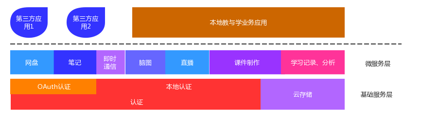
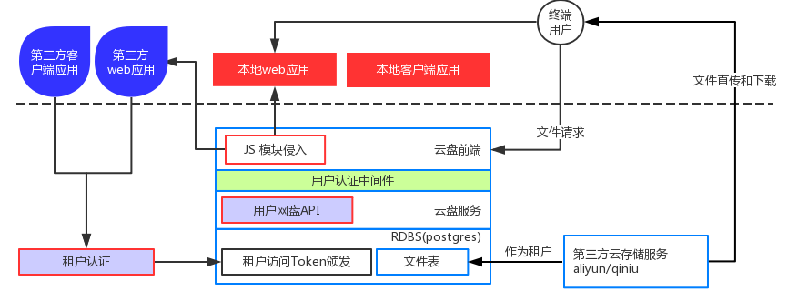

# SAAS
* 整个SAAS系统的服务对象为本地教务应用和租户教务应用
* 分为基础服务层和微服务层
    * 基础服务层 为微服务层提供基础服务
    * 微服务层直接为服务对象服务
* 前后端分离
* 三端统一
* 业务切割方式：微服务

# Authentication
> 为终端用户提供认证及用户相关服务  
> 为租户应用提供OAuth认证服务   
---
* 第三方认证接入
* 用户绑定机制
* 租户系统和Open Auth服务
* 高速会话服务器
* 外围服务，邮件和短信服务~

# Cloud Storage
> 为终端用户提供网盘服务  
> 为租户应用前端开发提供网盘JS前端模块  
> 为租户应用提供附件服务  
---
* 基于七牛云存储的网盘业务服务
* 前端网盘JS插件模块
* 基于租户认证的文件访问Token颁发服务
* 租户应用的附件服务

# LRS and Analysis System
>为租户和终端用户用户提供学习经历记录及分析服务
---
* 基于分布式Mongodb的学习记录存储服务
* Mongodb使用分片和复制集以满足离线计算任务的需求
* 消息队列驱动的云计算任务系统  

